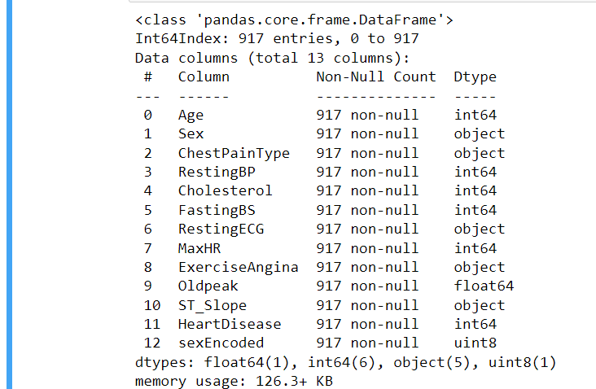
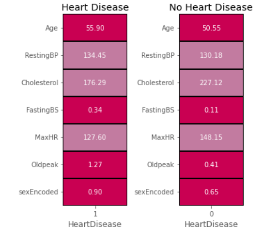
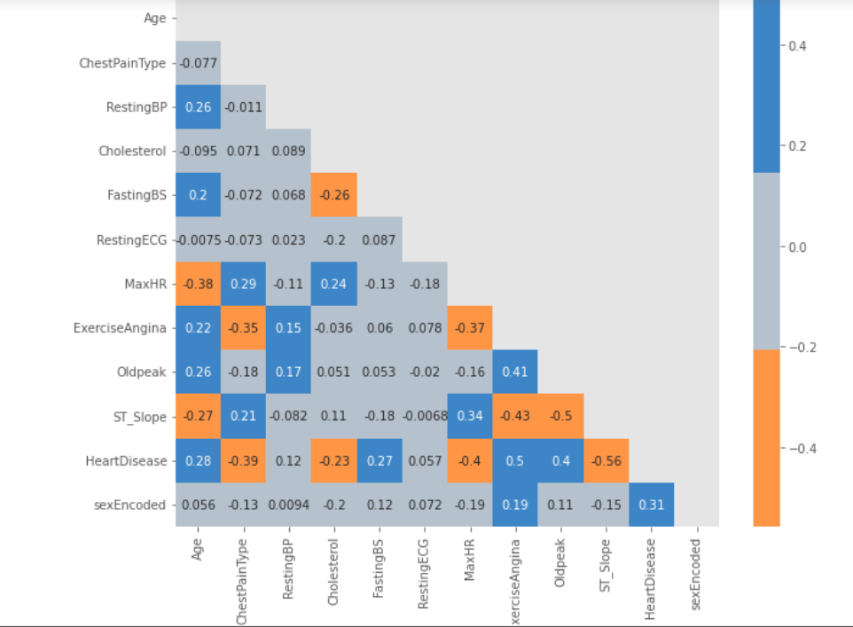
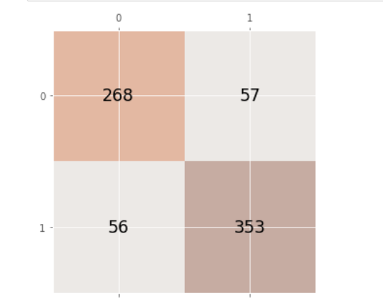
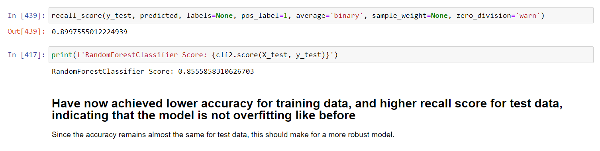

## Authors

- [@RohithOfRivia](https://github.com/RohithOfRivia)

## Table of Contents

  - [Introduction](#introduction)
  - [Data source](#data-source)
  - [Methods](#methods)
  - [Tech Stack](#tech-stack)
  - [Quick glance at the results](#quick-glance-at-the-results)
  - [Lessons learned and recommendations](#lessons-learned-and-recommendation)
  - [Limitations and what can be improved](#limitations-and-what-can-be-improved)
  - [Run Locally](#run-locally)
  - [Explore the notebook](#explore-the-notebook)

## Introduction
The purpose of this project is to predict whether a patient is suffering from a heart disease based on 12 attributes about the patient. Since cardivascular diseases cause about 9 million deaths worldwide, yearly. Identifying any heart disease is vital in the recovery of a patient and preventing more fatalities. Here, a machine learning model can help detect a patient with heart disease with high speed.

## Data source

- [Kaggle heart-failure-prediction](https://www.kaggle.com/datasets/fedesoriano/heart-failure-prediction)

## Methods

- Exploratory data analysis
- Bivariate analysis
- Multivariate correlation
- Classification
- Ensemble methods

## Tech Stack

- Python (Pandas, Matplotlib, Seaborn, Scikit-Learn)

## Quick glance at the results

Features:
\
\

\

Mean values for those with and without heart disease:
\
\

\
\
Correlation between the features:
\
\

\
\
Confusion matrix of Random Forest Classifier:
\
\

\
\
Recall score for random forest classifier:

  
- **The final model used for this project: Random Forest Classifier**
**Metrics used: Recall**    

**Why choose recall?**
- Since the objective of this problem is to identify the presence of heart disease with minimal false negatives.
 
- Since such a large amount of people lose their lives due to heart failure, it is important correctly classify all patients having heart disease correctly. Leaving a heart patient undiagnosed can be fatal.

 ## Lessons learned and recommendation

- Based on the analysis and the final model of this project, ST Slope is the most important predictor of heart disease. That being said, there are many more features that are also important to predict - Age, Chest pain type, Oldpeak, just to name a few.
  
- Even though there are many attributes that are similarly correlated, to the presence of heart disease, the feature importances of the model did not seem to always follow the same pattern. This could be because there is more than just a linear relationship between these features.

## Limitations and what can be improved
- Find non linear relatioships using multivariate mutual information, maximum information coefficient.
 
- Hyperparameter tuning with cross validation.

- Statistical tests (Chi-Square Test, ANOVA, etc.)

## Explore the notebook

To explore the notebook file [here]https://nbviewer.org/github/RohithOfRivia/Heart-Disease-Prediction/blob/6785386f319bafe4fb514d61153c533a02c64431/Heart%20Failure%20EDA%20and%20Prediction%28DT%20and%20RFC%29.ipynb)

Thanks for visiting!
